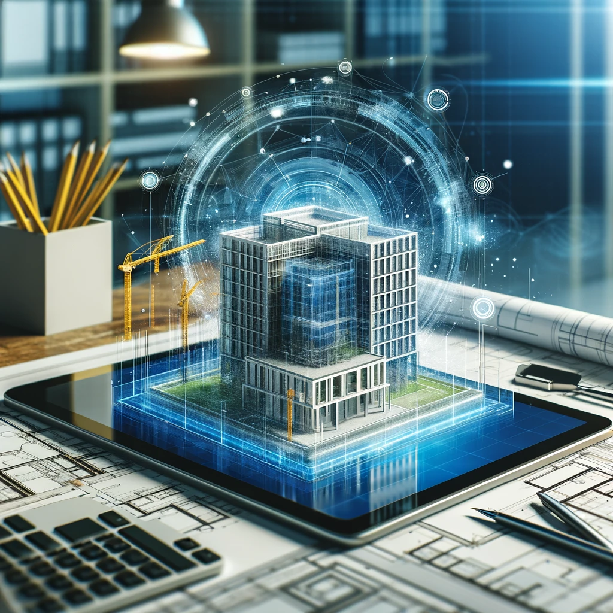

# Sortdesk

## Welcome to Sortdesk

At Sortdesk, we specialize in delivering advanced software development services for Architecture, Engineering, and Construction (AEC) companies. Our focus is on creating innovative digital solutions that streamline processes, enhance productivity, and bring the future of digital construction to life.

### What We Do

Sortdesk is at the forefront of integrating technology with the construction industry. Our expertise ranges from developing intuitive software tools to implementing cutting-edge digital strategies for construction projects. We are committed to pushing the boundaries of what's possible in digital construction.

### Our Tools

#### Sortdesk Viewer
- **Link**: [Sortdesk Viewer](https://viewer.sortdesk.com)
- **Description**: The Sortdesk Viewer is our state-of-the-art online tool for viewing, analyzing, and interacting with IFC models. Designed for ease of use and maximum efficiency, it provides an unparalleled experience in digital construction visualization.

### Connect with Us

- **Website**: [Sortdesk](https://sortdesk.com)

Thank you for visiting our GitHub page. For more information on our services and projects, please visit our website or get in touch with us.
